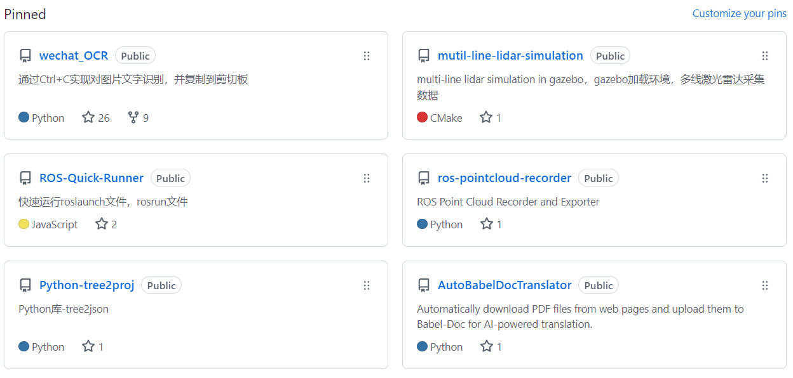

# 在GitHub的OverView中展示GitHub项目卡片
在GitHub上的OverView中展示GitHub项目卡片，默认只有6个，例如：

可以通过下面的方式展示更多的项目卡片。

## 一行展示一个项目卡片

## 一行展示两个项目卡片
|  |  |
|--|--|

## 一行展示三个项目卡片

|  |  |  |
|--|--|--|

## 总结

综上来看，我个人建议使用一行两个的方案，不会过大与过小。

你可以将上面的代码片段，替换为自己的项目卡片链接即可。，插入到你个人Overview中的REAMDME.md中。

**目前，这种方式，唯一的缺点，可能就是存在边框线。**
